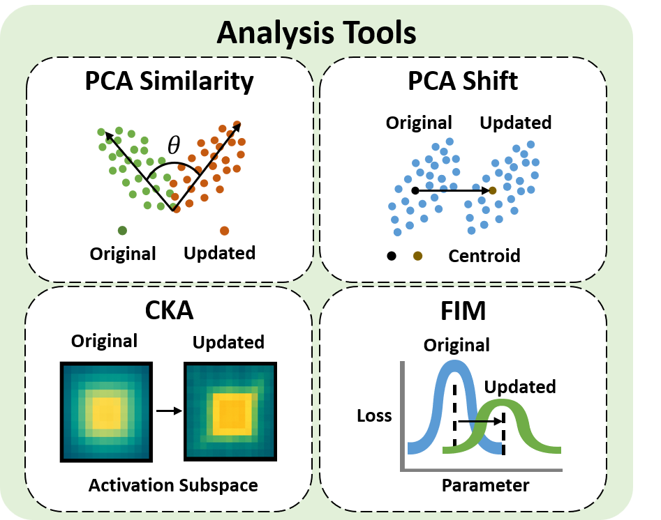
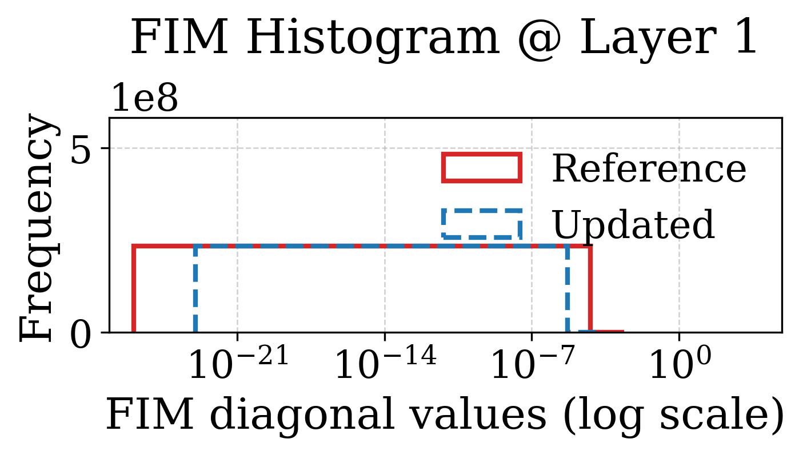
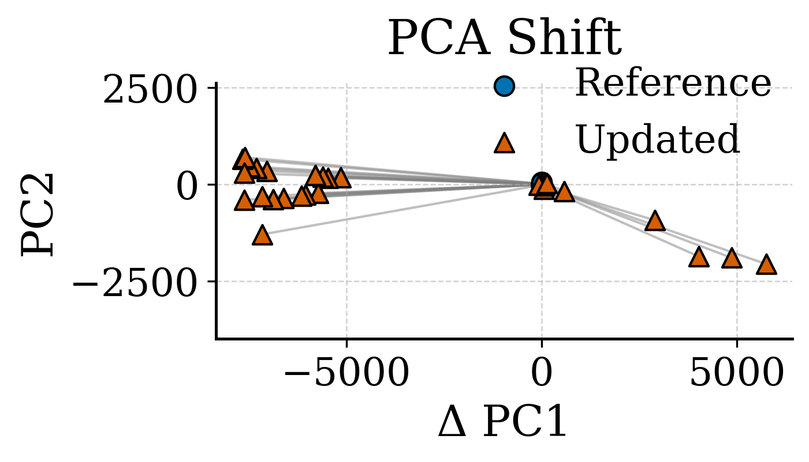
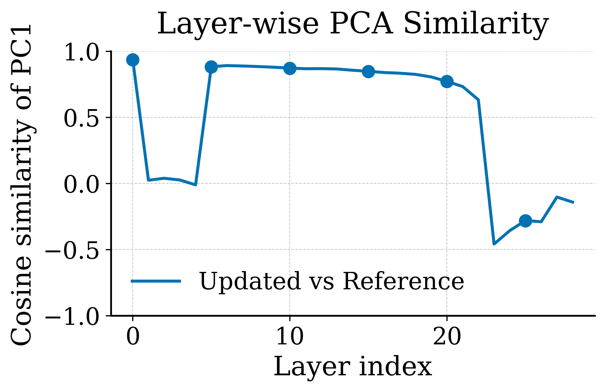
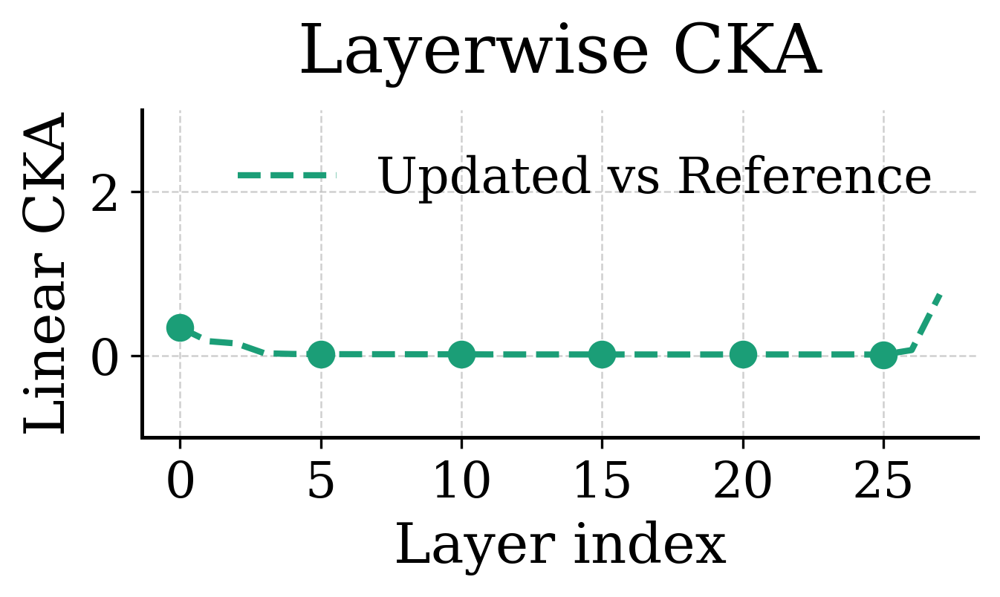

<h1 align="center">Representational Analysis</h1>

[](https://pypi.org/project/representational_analysis/)  
[](LICENSE)

A unified toolkit to quantify and visualize how large language models (LLMs) change their internal representations during unlearning, fine-tuning, and other interventions.  
Key features include:

## 🔍 Features

- **Fisher Information Matrix** histograms[^1]: Observe how the sensitivity of parameter levels changes.  
- **PCA shift** (Δ PC1 vs. PC2)[^2]: Observe the change in the “center” of the model in the directions of the first two principal components.  
- **PCA cosine similarity** of principal components[^2]: Measures the similarity between the most important representation direction.  
- **Layer-wise CKA** (Centered Kernel Alignment)[^3]: Observe the similarity fluctuations of each layer’s representation subspace.  


<p align="center">
  
</p>

## 🔧 Installation

```bash
# From PyPI
pip install representational-analysis

````

---
## 🛠️ Python API

Import and call the unified function directly:

```python
from representational_toolkit.analysis import run_feature_analysis

query = [
    "The quick brown fox jumps over the lazy dog.",
    "Unlearning LLMs is an active area of research."
]
````

### 1) Fisher Information

```python
run_feature_analysis(
    feature="fim",
    model_reference_path="Qwen/Qwen2.5-7B",
    model_path="your_own_model_path",
    query=query,
    output_path="./fim_output",   # directory for per-layer PDFs
    device="cuda",
    batch_size=4,
    num_batches=10,
    max_length=128
)
```
<p align="center">
  
</p>

### 2) PCA Shift (Δ PC1 vs. PC2)

```python
run_feature_analysis(
    feature="pca_shift",
    model_reference_path="Qwen/Qwen2.5-7B",
    model_path="your_own_model_path",
    query=query,
    output_path="./pca_shift.pdf",  # single PDF or .png
    device="cuda",
    max_length=128
)
```
<p align="center">
  
</p>

### 3) PCA Cosine Similarity of PC1

```python
run_feature_analysis(
    feature="pca_sim",
    model_reference_path="Qwen/Qwen2.5-7B",
    model_path="your_own_model_path",
    query=query,
    output_path="./pca_sim.pdf",    # single PDF or .png
    device="cuda",
    max_length=128
)
```
<p align="center">
  
</p>

### 4) Layer-wise CKA

```python
run_feature_analysis(
    feature="cka",
    model_reference_path="Qwen/Qwen2.5-7B",
    model_path="your_own_model_path",
    query=query,
    output_path="./cka.pdf",        # single PDF or .png
    device="cuda",
    batch_size=4,
    num_batches=10,
    max_length=128
)
```
<p align="center">
  
</p>

---

## 📁 Project Structure

```
representational_analysis/
├── pyproject.toml
└── src/
    └── representational_toolkit/
        ├── __init__.py
        ├── analysis.py         # `run_analysis()` entry point
        ├── fisher_analysis.py     # Fisher Information
        ├── pca_shift_analysis.py #PCA Shift
        ├── pca_sim_analysis.py   #PCA Similarity
        └── cka_analysis.py     # Layer-wise CKA
```

## 📄 Paper

**Unlearning Isn't Deletion: Investigating Reversibility of Machine Unlearning in LLMs**


## 📜 License

This project is licensed under MIT License. See [LICENSE](LICENSE) for details.

## 📖 References

[^1]: _Towards Robust and Parameter-Efficient Knowledge Unlearning for LLMs_, ICLR 2025.
[^2]: _Spurious Forgetting in Continual Learning of Language Models_, ICLR 2025. 
[^3]: _Similarity of neural network representations revisited_, ICML 2019.
