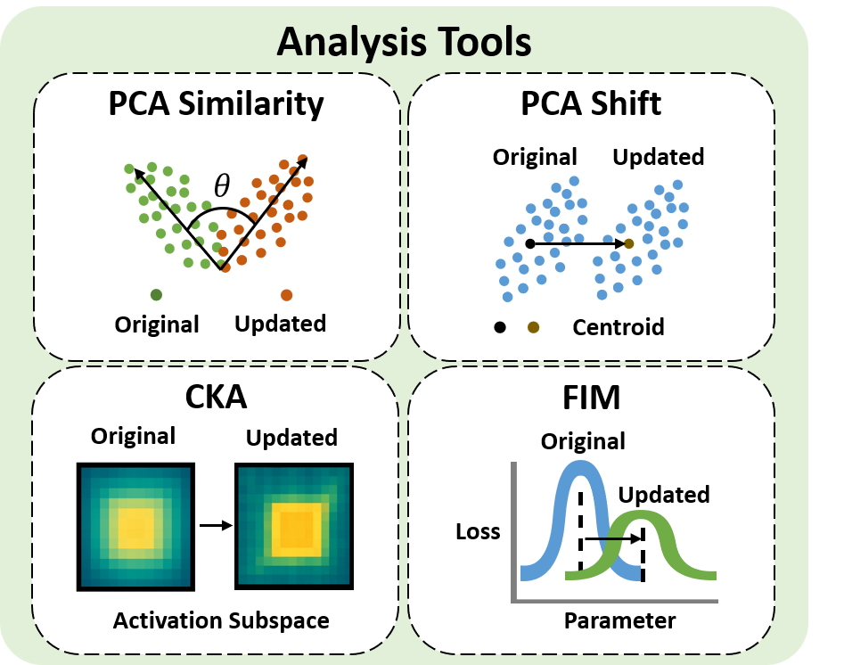
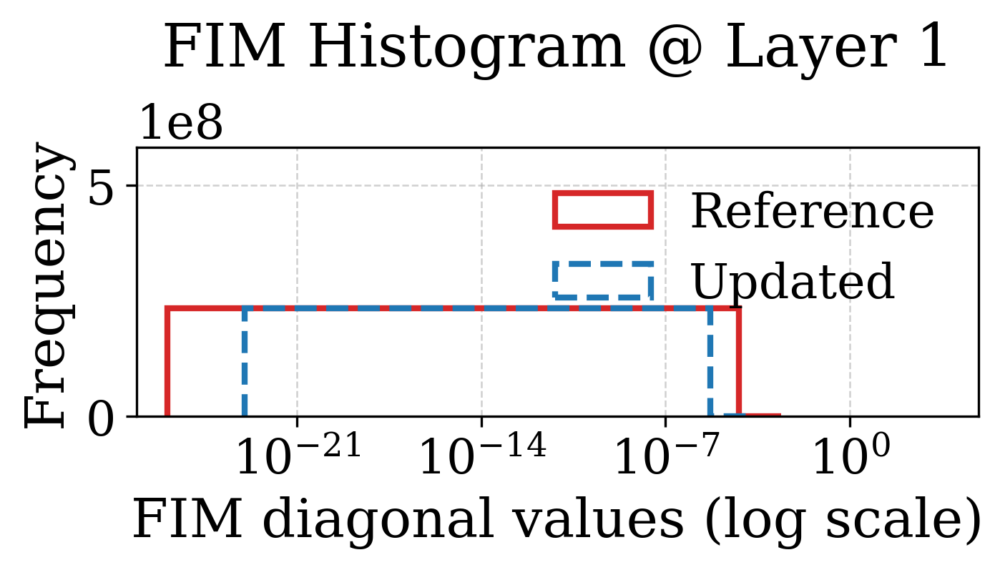
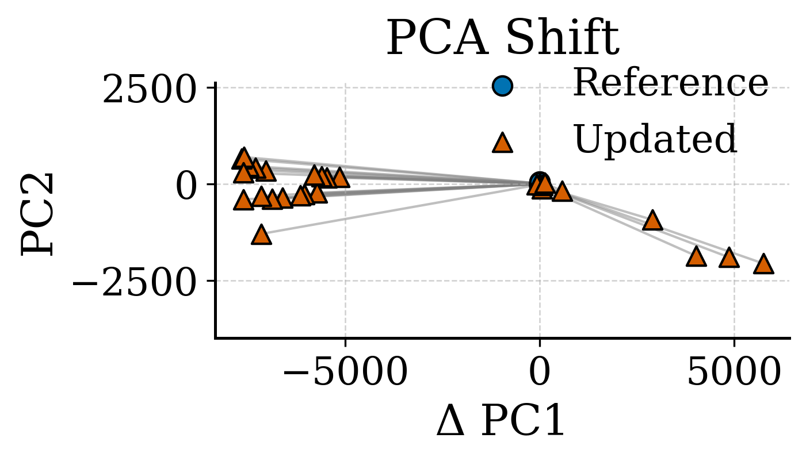
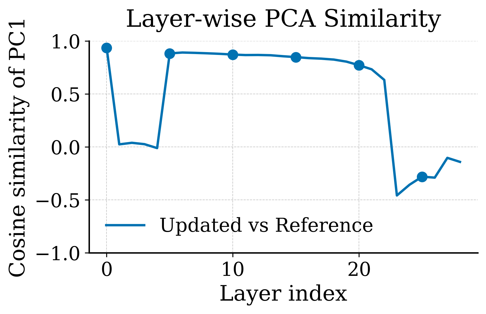
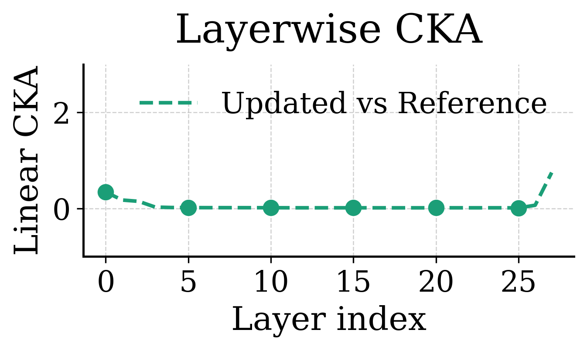

<h1 align="center">Representational Analysis for LLM Unlearning</h1>

<p align="center">
  A lightweight toolkit for comparing how a reference language model and an updated model represent the same data.
</p>

<p align="center">
  <a href="https://arxiv.org/abs/2505.16831"></a>
  <a href="https://arxiv.org/abs/2505.16831"></a>
  <a href="https://pypi.org/project/representational-analysis/"></a>
  <a href="https://www.python.org/"></a>
  <a href="LICENSE"></a>
</p>

This repository provides the representation-level analysis toolkit introduced in **[Unlearning Isn't Deletion: Investigating Reversibility of Machine Unlearning in LLMs](https://arxiv.org/abs/2505.16831)**, accepted at **ICML 2026**. It helps diagnose whether an intervention such as machine unlearning, fine-tuning, or model editing has genuinely changed a model's internal representations or has only altered its observable behavior.

<p align="center">
  
</p>

## Why representation-level analysis?

Task-level metrics such as accuracy and perplexity can indicate that a model has forgotten a target, but they do not reveal whether the underlying information has been removed or merely suppressed. Comparing the original and updated models at the representation level provides a complementary view of:

- **where** an intervention changes the model;
- **how strongly** representations and parameter sensitivities move; and
- **whether** apparently forgotten behavior may remain easy to recover.

## Analyses

| Analysis | What it measures | Output |
| --- | --- | --- |
| Fisher Information Matrix (`fim`) | Layer-wise changes in parameter sensitivity, estimated from squared gradients | One histogram per layer |
| PCA shift (`pca_shift`) | Movement of the updated model relative to the reference model in a PCA space | Layer-wise shift plot |
| PCA similarity (`pca_sim`) | Cosine similarity between the leading principal directions of the two models | Similarity-by-layer curve |
| Centered Kernel Alignment (`cka`) | Similarity between the layer-wise representation spaces of the two models | CKA-by-layer curve |

## Installation

Install the latest released version from PyPI:

```bash
pip install representational-analysis
```

To install the current repository in editable mode:

```bash
git clone https://github.com/XiaoyuXU1/Representational_Analysis_Tools.git
cd Representational_Analysis_Tools
pip install -e ./representational_analysis
```

Python 3.10 or later is required. A CUDA-capable GPU is recommended for analyzing large models.

## Quick start

The toolkit compares a **reference model** with an **updated model** on the same set of text inputs. Both models should use compatible architectures and tokenization.

```python
from representational_toolkit.analysis import run_feature_analysis

queries = [
    "The quick brown fox jumps over the lazy dog.",
    "Machine unlearning aims to remove the influence of selected data.",
]

run_feature_analysis(
    feature="cka",
    model_reference_path="Qwen/Qwen2.5-7B",
    model_path="path/to/your/updated-model",
    query=queries,
    output_path="./outputs/cka.pdf",
    device="cuda",
    batch_size=4,
    num_batches=10,
    max_length=128,
)
```

Set `feature` to one of `fim`, `pca_shift`, `pca_sim`, or `cka`. For `fim`, `output_path` should be a directory; for the other analyses, it should be an image or PDF filename.

## Examples

<details>
<summary><strong>Fisher Information Matrix</strong></summary>

```python
run_feature_analysis(
    feature="fim",
    model_reference_path="Qwen/Qwen2.5-7B",
    model_path="path/to/your/updated-model",
    query=queries,
    output_path="./outputs/fim",
    device="cuda",
    batch_size=4,
    num_batches=10,
    max_length=128,
)
```

<p align="center">
  
</p>

</details>

<details>
<summary><strong>PCA shift</strong></summary>

```python
run_feature_analysis(
    feature="pca_shift",
    model_reference_path="Qwen/Qwen2.5-7B",
    model_path="path/to/your/updated-model",
    query=queries,
    output_path="./outputs/pca_shift.pdf",
    device="cuda",
    max_length=128,
)
```

<p align="center">
  
</p>

</details>

<details>
<summary><strong>PCA cosine similarity</strong></summary>

```python
run_feature_analysis(
    feature="pca_sim",
    model_reference_path="Qwen/Qwen2.5-7B",
    model_path="path/to/your/updated-model",
    query=queries,
    output_path="./outputs/pca_similarity.pdf",
    device="cuda",
    max_length=128,
)
```

<p align="center">
  
</p>

</details>

<details>
<summary><strong>Layer-wise CKA</strong></summary>

```python
run_feature_analysis(
    feature="cka",
    model_reference_path="Qwen/Qwen2.5-7B",
    model_path="path/to/your/updated-model",
    query=queries,
    output_path="./outputs/cka.pdf",
    device="cuda",
    batch_size=4,
    num_batches=10,
    max_length=128,
)
```

<p align="center">
  
</p>

</details>

## Recommended workflow

1. Select a reference checkpoint and an updated checkpoint produced by unlearning, fine-tuning, or another intervention.
2. Build a representative query set, including target data and suitable retain or control data when relevant.
3. Run more than one analysis: each metric captures a different aspect of representational change.
4. Interpret the plots alongside task-level performance and relearning tests rather than as standalone evidence of deletion.

## Project structure

```text
representational_analysis/
├── pyproject.toml
└── src/
    └── representational_toolkit/
        ├── __init__.py
        ├── analysis.py             # Unified run_feature_analysis entry point
        ├── fisher_analysis.py      # Fisher information analysis
        ├── pca_shift_analysis.py   # PCA shift analysis
        ├── pca_sim_analysis.py     # PCA direction similarity
        └── cka_analysis.py         # Layer-wise linear CKA
```

## Paper

**Unlearning Isn't Deletion: Investigating Reversibility of Machine Unlearning in LLMs**<br>
Xiaoyu Xu, Xiang Yue, Yang Liu, Qingqing Ye, Huadi Zheng, Peizhao Hu, Minxin Du, and Haibo Hu<br>
Accepted at the **43rd International Conference on Machine Learning (ICML 2026)**.

The paper shows that task-level forgetting can be reversible: a model may appear to forget while recovering its original behavior after limited fine-tuning. The proposed analyses characterize this gap through representational drift and help distinguish different forgetting regimes.

```bibtex
@inproceedings{xu2026unlearning,
  title     = {Unlearning Isn't Deletion: Investigating Reversibility of Machine Unlearning in LLMs},
  author    = {Xu, Xiaoyu and Yue, Xiang and Liu, Yang and Ye, Qingqing and Zheng, Huadi and Hu, Peizhao and Du, Minxin and Hu, Haibo},
  booktitle = {Proceedings of the 43rd International Conference on Machine Learning},
  year      = {2026}
}
```

## License

This project is released under the [MIT License](LICENSE).

## References

1. *Towards Robust and Parameter-Efficient Knowledge Unlearning for LLMs.* ICLR 2025.
2. *Spurious Forgetting in Continual Learning of Language Models.* ICLR 2025.
3. *Similarity of Neural Network Representations Revisited.* ICML 2019.
